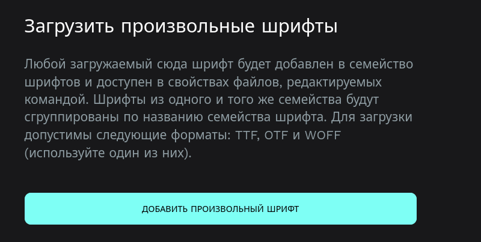

# Типография в интерфейсе

Для типографии (шрифтов) пока что используется один шрифт — tt fors.

Его можно найти в архиве tt_fors.zip в текущем репозитории.

# Установка шрифтов в Penpot

1. Для начала необходимо получить шрифты. Их можно скачать в любом удобном месте. Скачанные файлы шрифтов лучше поместить в отдельную папку для дальнейшего импорта в Penpot.

2. Чтобы импортировать шрифты в Penpot, вы должны находиться на главной странице Penpot, где можно создавать проекты (Projects) и черновики (Drafts). Внизу будет кнопка _Шрифты_:

   

3. Далее перейдите на вкладку _Шрифты_, которая находится в верхнем меню. Там будет кнопка _Импортировать шрифты_; при нажатии откроется окно для выбора файлов. Выберите все файлы шрифтов, которые вы хотите импортировать, и нажмите кнопку _Открыть_:

   

   После этого указанные шрифты можно использовать на холсте.
