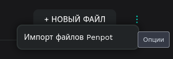

# Импорт проекта в Penpot

Чтобы импортировать проект в Penpot, перейдите на главную страницу Penpot, где находятся кнопки _Проекты_ и _Черновики_.

Чтобы импортировать `.penpot` файл:

- Нажмите на три точки справа сверху (в том месте, где находится кнопка _+ Новый файл_) и выберите «Импорт файлов Penpot».
- Выберите нужный `.penpot` файл — он импортируется в ваш аккаунт.
- После импорта файл будет доступен для открытия и редактирования как обычный проект.

Вы также можете копировать отдельные элементы из импортированного файла и вставлять их в другой проект, если не требуется импортировать весь проект целиком.
