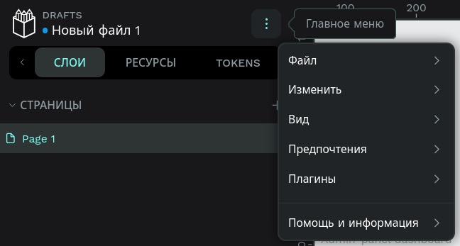
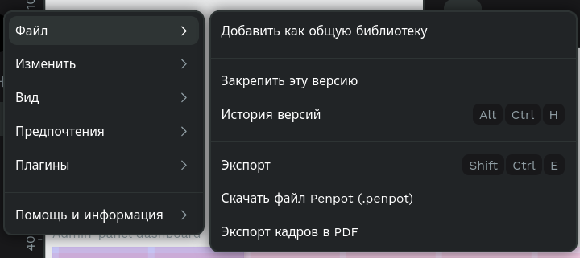

# Экспорт проекта в файл .penpot

1. Чтобы экспортировать проект в файл `.penpot`, необходимо находиться на странице проекта (там, где вы работаете над дизайном). Сверху на левой панели нажмите кнопку с тремя точками, чтобы открыть меню для работы с проектом.

   

2. Выберите кнопку _Файл_, после чего откроется меню с возможностью экспорта проекта. Выберите пункт _Скачать файл Penpot (`.penpot`)_. Файл `.penpot` будет скачан — его можно импортировать в другой проект или использовать для резервного копирования.

   
